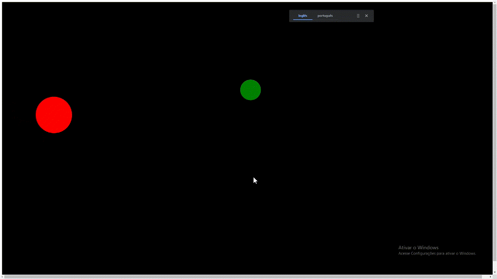
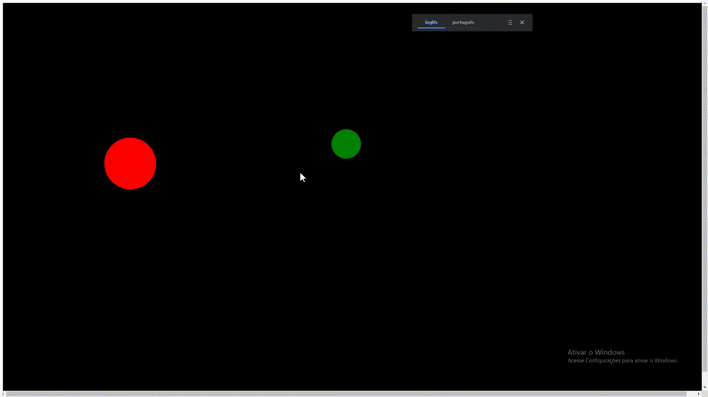
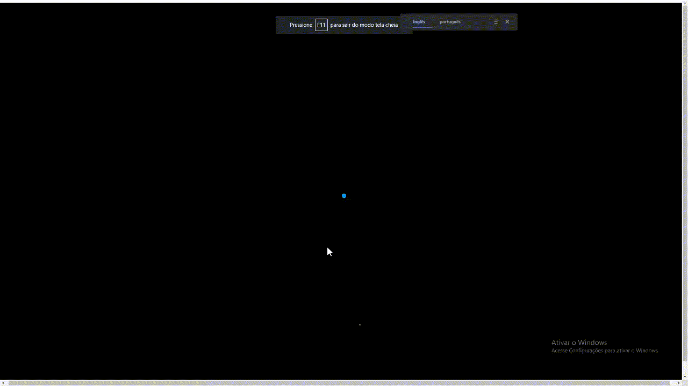
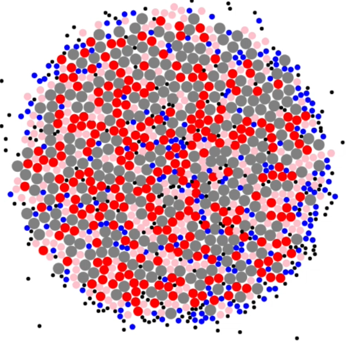
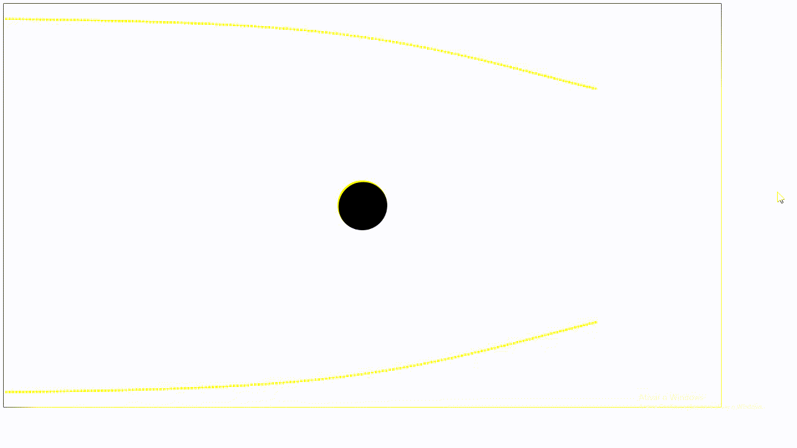

# Orbitals sandbox
A simple physics engine created with vanilla JavaScript to emulate gravitational force in 2D.
Integrated with a spatial collision system, the program can simulate a lot of real events that occur in the universe.
To create the program, physics concepts like Newton's laws, gravitational force, momentum, and energy conservation were used.

## Technology 

Here are the technologies used in this project.

* Browserfy
* Vanila Javascript

## Getting started

1 - Install dependencies: 

[Install Nodejs](https://nodejs.org/)

2 - Clone the repository running into your terminal:

```sh
git clone https://github.com/ppkat/quizBot-discord.git
```

3 - Open the client.html file on your browser

## How to use
Working in process

## Features

### 1.  The built-in physics engine includes a collision system, allowing you to define different sizes, masses, speeds, and colors for the bodies you want to simulate collisions with.
In this example there is a red ball with properties: "mass: 20, x: 0, y: 436, radius: 70, speedx: 5, speedy: 0"  that colides with a green ball with: "mass: 16, x: 1000, y: 280, radius: 40, speedx: -1, speedy: 1.5"



And if the green mass change to 45 this happen



### 2. Beyond two-body collisions, you can simulate more particles. And many physic concepts can be observed only with the collision logic (without the gravity). A example is the gas behavior:


Here we can see that a single molecule can energize the entire system and also see that the gas expands to equally fill  all areas of the container. The speed at which molecules are moving represents the temperature that the system is.


Here we can see the practical application of the gas laws. When the volume decrease, the pressure and temperature increase, which is evident from the increased intensity of molecule collisions.

### 3. Still using only collisions, we can also see the longitudinal waves behavior like Reflection and energy transmission


### 4. Futhermore, we can add gravity for make simulations more interesting. How for example, the moon and Earth on a real scale



### 5. Alternatively, we can observe how a nebulous cloud with different elements can form a star


How all balls in this gif have the same mass but different sizes, we also can see the density concept, since the smallest stay on center, and this prove it how a directly consequence of gravity.

The same occurs when the big bodies are more dense:


And if all bodies have the same density, the star become homogeneous:



### 6. One more interesting thing to se is the time-space visualization. Here are 2 beams of light having their trajectory changed by the massive body in the center



  ## Authors

  * **João Pedro Gaspar Pereira** 

  Please follow github and give me a star if you like the project!
  It will be continued, and GUI controls will be added to create any simulation the user desires
